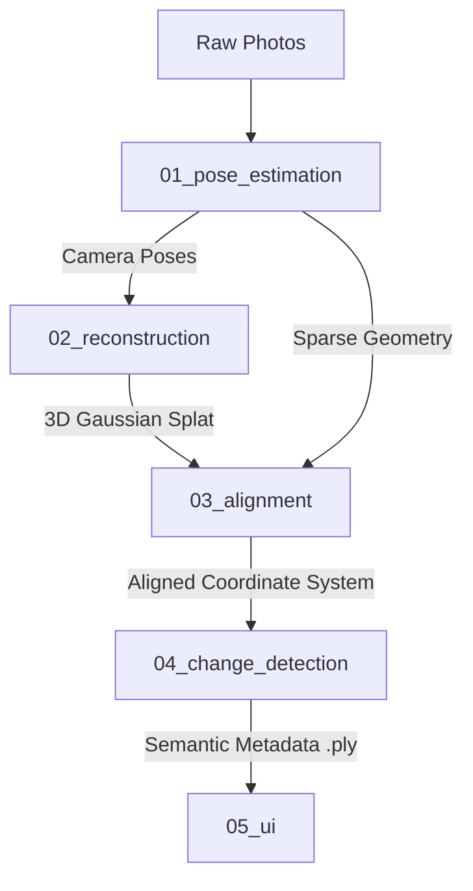

Here is a polished, professional, and highly structured starter `README.md` for your repository. It explains the entire 4D architecture, the 5-module pipeline, and how to use `uv` and COLMAP to run the project.

---

# 4D Spatio-Temporal Construction Reconstruction

A high-performance computer vision pipeline designed to ingest chronological 2D image sequences from dynamic construction sites, perform sparse 3D reconstruction, register multiple sessions into a unified 4D timeline, and utilize human-in-the-loop AI segmentation to detect and isolate physical changes over time.

---

## 🏗️ Core Architecture & Pipeline

This project is divided into five modular stages, moving from raw images to an interactive WebGL spatial-analysis interface:



### Module Breakdown

1. **`01_pose_estimation`**: Preprocesses fisheye lens distortion, dynamically masks out the camera operator, and automates COLMAP Structure-from-Motion (SfM) to determine exact camera trajectories.
2. **`02_gaussian_splatting`**: Houses our custom fork of the **3DGUT** library (as a git submodule) to train high-fidelity 3D Gaussian Splats of the site.
3. **`03_sessions_alignment`**: Computes a rigid 3D transformation matrix (Registration) to perfectly align chronological sessions (e.g., Day 1 to Day 2) into the same coordinate space.
4. **`04_change_detection`**: Segments 2D frames using SAM 2.1 / YOLO, projects those masks into 3D space via a multi-view voting algorithm, and non-destructively encodes the semantic metadata directly into the `.ply` file.
5. **`05_ui`**: A lightweight React + Spark.js web app utilizing a `THREE.DataTexture` GPU-shader pipeline to let users interactively toggle and isolate physical changes on the web.

---

## 🛠️ Installation & Setup

This project uses **`uv`**, a fast Python package installer and resolver written in Rust, alongside standard **`npm`** for the frontend.

### Prerequisites

* [Install uv](https://github.com/astral-sh/uv)
* Install **COLMAP** on your system (ensure it is accessible via your CLI/PATH)
* [Install Node.js & npm](https://nodejs.org/)

### Quick Start (Python Pipeline)

Clone the repository and initialize the virtual environment:

```bash
# Clone the repository
git clone https://github.com/your-username/4d-construction-reconstruction.git
cd 4d-construction-reconstruction

# Automatically create the virtual environment and install all dependencies
uv sync

```

### Quick Start (UI Frontend)

To run the React viewer:

```bash
cd 05_ui
npm install
npm run dev

```

---

## 🚀 Running the Pipeline

### Step 1: Preprocessing & Pose Estimation

Place your raw construction photos inside `data/raw/`. Then, run the preprocessors and automated COLMAP wrapper:

```bash
# Prepare images and run Structure-from-Motion
uv run 01_pose_estimation/run_colmap_pipeline.py

```

### Step 2: 3D Reconstruction

Train your Gaussian Splat using the sparse geometry solved by COLMAP:

```bash
uv run 02_reconstruction/train_splat.py

```

### Step 3: Run Change Isolation & Metadata Encoding

Once your 3D Splat is trained and you have generated 2D masks of the changes (e.g., using X-AnyLabeling), run the backprojection and metadata injection script:

```bash
uv run 04_change_detection/encode_metadata.py

```

This script evaluates the camera rays and appends an invisible `isolated_object` column (`uint8`) to your `.ply` file.

---

## 📁 Repository Structure

```text
4d-construction-reconstruction/
├── .gitignore
├── pyproject.toml                   # Managed by uv
├── uv.lock                          # Python lockfile
├── README.md
│
├── data/                            # Local sandbox (ignored by Git)
│   ├── raw/                         # Place raw images here (uses .gitkeep)
│   ├── processed/                   # Preprocessed images & masks
│   └── outputs/                     # Outputs, transform matrices, splats
│
├── 01_pose_estimation/
│   ├── preprocess_fisheye.py        # Static lens masking
│   ├── mask_dynamic_objects.py      # Camera operator cleanup
│   └── run_colmap_pipeline.py       # COLMAP automation wrapper
│
├── 02_reconstruction/
│   ├── third_party/
│   │   └── 3DGUT/                   # Tweaked reconstruction repo (Git Submodule)
│   └── train_splat.py
│
├── 03_alignment/
│   ├── extract_features.py
│   └── compute_transform.py         # Solves spatial session alignment
│
├── 04_change_detection/
│   ├── segment_changes.py           # 2D AI segmentation inference
│   ├── project_masks_3d.py          # Vectorized matrix raycasting
│   └── encode_metadata.py           # Injects 'isolated_object' into .ply
│
└── 05_ui/                           # React / Vite / Spark.js Web Interface

```

---

## 🔒 Git & Data Policy

Because raw 2D image sequences and 3D `.ply` files easily exceed Git's storage limits, **all raw, processed, and output data directories are explicitly ignored by Git** via `.gitignore`.

To maintain repository structure when cloning, the project uses empty `.gitkeep` files inside the `data/` directory tree. **Do not force commit `.ply`, `.bin`, or `.db` files to GitHub.**