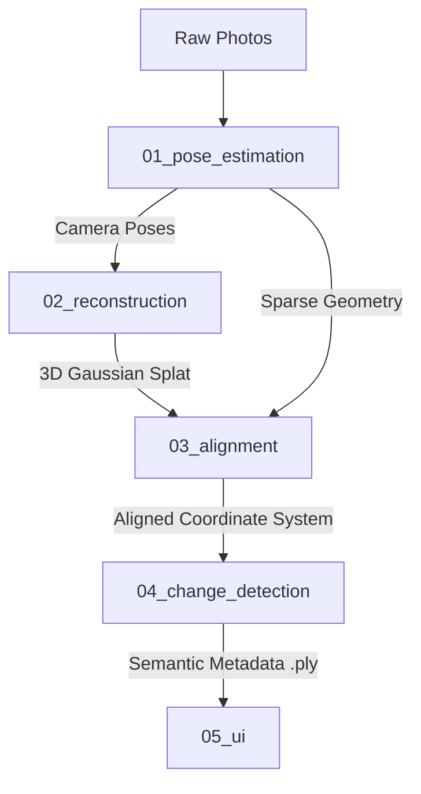

# 4D Spatio-Temporal Construction Reconstruction

Pipeline designed to ingest chronological 2D image sequences from dynamic construction sites, perform sparse 3D reconstruction, register multiple sessions into a unified 4D timeline.

---

## 🏗️ Core Architecture & Pipeline

This project is divided into five modular stages, moving from raw images to an interactive WebGL spatial-analysis interface:



### Module Breakdown

1. **`01_pose_estimation`**: Preprocesses fisheye lens distortion, dynamically masks out the camera operator, and automates COLMAP Structure-from-Motion (SfM) to determine exact camera trajectories.
2. **`02_gaussian_splatting`**: Houses our custom fork of the **3DGUT** library (as a git submodule) to train high-fidelity 3D Gaussian Splats of the site.
3. **`03_sessions_alignment`**: Computes a rigid 3D transformation matrix (Registration) to perfectly align chronological sessions (e.g., Day 1 to Day 2) into the same coordinate space.
4. **`04_change_detection`**: Segments 2D frames using SAM 2.1 / YOLO, projects those masks into 3D space via a multi-view voting algorithm, and non-destructively encodes the semantic metadata directly into the `.ply` file.
5. **`05_ui`**: A lightweight React + Spark.js web app utilizing a `THREE.DataTexture` GPU-shader pipeline to let users interactively toggle and isolate physical changes on the web.

---

## 🛠️ Installation & Setup

This project uses **`uv`**, a fast Python package installer and resolver written in Rust, alongside standard **`npm`** for the frontend.

### Prerequisites

* [Install uv](https://github.com/astral-sh/uv)
* Install **COLMAP** on your system (ensure it is accessible via your CLI/PATH)
* [Install Node.js & npm](https://nodejs.org/)

### Quick Start (Python Pipeline)

Clone the repository and initialize the virtual environment:

```bash
# Clone the repository
git clone https://github.com/your-username/4d-construction-reconstruction.git
cd 4d-construction-reconstruction

# Automatically create the virtual environment and install all dependencies
uv sync

```

### Quick Start (UI Frontend)

To run the React viewer:

```bash
cd 05_ui
npm install
npm run dev

```

---

## 🚀 Running the Pipeline

Please refer to individual README.md file on each of the pipeline's directory.
